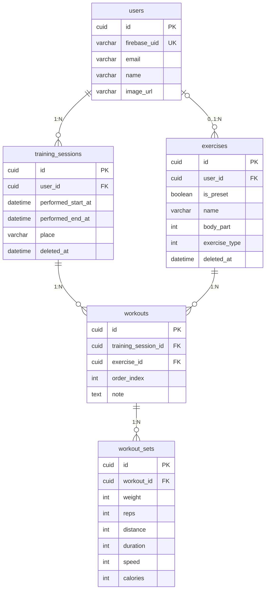

# DB テーブル設計

## 概要

このドキュメントは、筋トレ記録アプリ「Gym Note」のデータベース設計を定義しています。

ユーザーは日々のトレーニングセッション（TrainingSession）を記録し、各セッションで行った種目（Exercise）ごとに、ワークアウト（Workout）とセット記録（WorkoutSet）を管理できます。

### 主要な概念

| テーブル          | 役割                                                             |
| ----------------- | ---------------------------------------------------------------- |
| users             | アプリのユーザー情報（Firebase Auth 連携）                       |
| training_sessions | トレーニング日の記録（いつ、どのくらいの時間）                   |
| exercises         | 種目マスタ（プリセット種目 + ユーザーカスタム種目）              |
| workouts          | トレーニング日に行った種目（1つの種目の実施記録）                |
| workout_sets      | 各種目で行ったセットごとの重量・回数（筋トレ）または距離・時間等（有酸素） |

### データ構造のイメージ

```
Exercise（種目マスタ）
├── [プリセット] ベンチプレス, スクワット, デッドリフト, ランニング ...（全ユーザー共通）
└── [カスタム] 田中さん専用のオリジナル種目

User: 田中さん
└── TrainingSession: 2024/1/15 10:00-11:30
      ├── Workout: ベンチプレス (order: 0)  ← 筋トレ種目
      │     ├── Set1: 60,000g × 10回
      │     ├── Set2: 70,000g × 8回
      │     └── Set3: 80,000g × 5回
      │
      ├── Workout: スクワット (order: 1)    ← 筋トレ種目
      │     ├── Set1: 80,000g × 10回
      │     └── Set2: 100,000g × 6回
      │
      └── Workout: ランニング (order: 2)    ← 有酸素種目
            └── Set1: 5,000m, 30分, 10.0 km/h, 350 kcal
```

### ワークアウトテーブルが必要な理由

1. **多対多の関係を解決**
   - 同じ種目を別の日に何度もやる（1つの Exercise が複数の TrainingSession に紐づく）
   - 1回のトレーニングで複数の種目をやる（1つの TrainingSession が複数の Exercise に紐づく）

2. **種目の実施順序を保持**
   - `order_index` で「その日どの順番で種目をやったか」を記録できる

3. **セット記録の親テーブルとして機能**
   - WorkoutSet は「どの日の、どの種目の」セットかを特定する必要がある
   - Workout を親にすることで、この関係を自然に表現できる

---

## ER 図



---

## users（ユーザー）

| カラム名     | 型           | 制約     | 説明               |
| ------------ | ------------ | -------- | ------------------ |
| id           | CUID         | PK       | 主キー（自動生成） |
| firebase_uid | VARCHAR(255) | UNIQUE   | Firebase UID       |
| email        | VARCHAR(255) |          | メールアドレス     |
| name         | VARCHAR(255) |          | ユーザー名         |
| image_url    | VARCHAR(255) |          | プロフィール画像   |
| created_at   | DATETIME     | NOT NULL | 作成日時           |
| updated_at   | DATETIME     | NOT NULL | 更新日時           |

---

## training_sessions（トレーニングセッション）

1日のトレーニング全体を管理。日付、場所、開始・終了時刻を保持し、複数のワークアウトを含む。

| カラム名           | 型           | 制約        | 説明                 |
| ------------------ | ------------ | ----------- | -------------------- |
| id                 | CUID         | PK          | 主キー（自動生成）   |
| user_id            | CUID         | FK NOT NULL | ユーザーID           |
| performed_start_at | DATETIME     | NOT NULL    | トレーニング開始時刻 |
| performed_end_at   | DATETIME     |             | トレーニング終了時刻 |
| place              | VARCHAR(255) |             | 場所                 |
| deleted_at         | DATETIME     |             | 論理削除日時         |
| created_at         | DATETIME     | NOT NULL    | 作成日時             |
| updated_at         | DATETIME     | NOT NULL    | 更新日時             |

---

## exercises（種目マスタ）

種目を管理するマスタテーブル。プリセット種目（システム共通）とカスタム種目（ユーザー別）の両方を格納する。

| カラム名      | 型           | 制約     | 説明                                         |
| ------------- | ------------ | -------- | -------------------------------------------- |
| id            | CUID         | PK       | 主キー（自動生成）                           |
| user_id       | CUID         | FK       | ユーザーID（プリセットの場合は NULL）        |
| is_preset     | BOOLEAN      | NOT NULL | プリセット種目フラグ（デフォルト: false）    |
| name          | VARCHAR(255) | NOT NULL | 種目名                                       |
| body_part     | INTEGER      |          | 部位（enum: 胸、背中など）                   |
| exercise_type | INTEGER      | NOT NULL | 種目タイプ（0: 筋トレ, 1: 有酸素）デフォルト: 0 |
| deleted_at    | DATETIME     |          | 論理削除日時                                 |
| created_at    | DATETIME     | NOT NULL | 作成日時                                     |
| updated_at    | DATETIME     | NOT NULL | 更新日時                                     |

### プリセット種目とカスタム種目

| 種別           | is_preset | user_id    | 編集 | 削除 | 説明                         |
| -------------- | --------- | ---------- | ---- | ---- | ---------------------------- |
| プリセット種目 | true      | NULL       | 不可 | 不可 | システム提供の定番種目       |
| カスタム種目   | false     | ユーザーID | 可   | 可   | ユーザーが独自に追加した種目 |

### 複合ユニーク制約

- (user_id, name) - ユーザーごとに種目名がユニーク（カスタム種目のみ）

※ プリセット種目（user_id = NULL）は name のユニーク制約をアプリケーションレベルで制御

### Enum 定義

#### body_part（部位）

| 値  | 名前      | 説明 |
| --- | --------- | ---- |
| 0   | chest     | 胸   |
| 1   | back      | 背中 |
| 2   | shoulders | 肩   |
| 3   | arms      | 腕   |
| 4   | legs      | 脚   |
| 5   | core      | 体幹 |

#### exercise_type（種目タイプ）

| 値  | 名前     | 説明             |
| --- | -------- | ---------------- |
| 0   | strength | 筋力トレーニング |
| 1   | cardio   | 有酸素運動       |

---

## workouts（ワークアウト）

トレーニングセッション内の1つの種目の実施記録。種目、セット群、メモを保持。

| カラム名            | 型       | 制約        | 説明                   |
| ------------------- | -------- | ----------- | ---------------------- |
| id                  | CUID     | PK          | 主キー（自動生成）     |
| training_session_id | CUID     | FK NOT NULL | トレーニングセッションID |
| exercise_id         | CUID     | FK NOT NULL | 種目ID                 |
| order_index         | INTEGER  | NOT NULL    | 表示順                 |
| note                | TEXT     |             | メモ                   |
| created_at          | DATETIME | NOT NULL    | 作成日時               |
| updated_at          | DATETIME | NOT NULL    | 更新日時               |

### 複合ユニーク制約

- (training_session_id, exercise_id) - 同じセッションに同じ種目は1回のみ
- (training_session_id, order_index) - 同じセッション内で表示順は重複不可

---

## workout_sets（セット記録）

各種目で行ったセットごとの記録。筋トレ用と有酸素用のフィールドを持つ。

| カラム名   | 型       | 制約        | 説明                                            |
| ---------- | -------- | ----------- | ----------------------------------------------- |
| id         | CUID     | PK          | 主キー（自動生成）                              |
| workout_id | CUID     | FK NOT NULL | ワークアウトID                                  |
| weight     | INTEGER  |             | 重量（グラム）- フロント側で kg に変換          |
| reps       | INTEGER  |             | 回数                                            |
| distance   | INTEGER  |             | 距離（メートル）                                |
| duration   | INTEGER  |             | 時間（秒）                                      |
| speed      | INTEGER  |             | 速さ（0.1 km/h 単位）- 例: 10.5 km/h → 105      |
| calories   | INTEGER  |             | カロリー（kcal）                                |
| created_at | DATETIME | NOT NULL    | 作成日時                                        |
| updated_at | DATETIME | NOT NULL    | 更新日時                                        |

### 単位変換ルール

| フィールド | DB単位      | フロント表示単位 | 変換例                    |
| ---------- | ----------- | ---------------- | ------------------------- |
| weight     | グラム (g)  | キログラム (kg)  | 60,000g → 60kg            |
| distance   | メートル (m)| メートル/キロ    | 5,000m → 5km              |
| duration   | 秒 (s)      | 分/秒            | 1,800s → 30分             |
| speed      | 0.1 km/h    | km/h             | 105 → 10.5 km/h           |
| calories   | kcal        | kcal             | 350 → 350 kcal            |

### 種目タイプ別の使用フィールド

| 種目タイプ | 使用フィールド                        |
| ---------- | ------------------------------------- |
| 筋トレ     | weight, reps                          |
| 有酸素     | distance, duration, speed, calories   |
