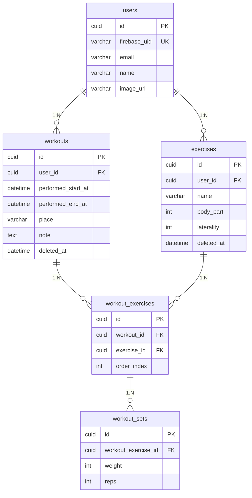

# DB テーブル設計

## 概要

このドキュメントは、筋トレ記録アプリ「Gym Note」のデータベース設計を定義しています。

ユーザーは日々のトレーニング（Workout）を記録し、各トレーニングで行った種目（Exercise）ごとに、セット数・重量・回数（WorkoutSet）を管理できます。

### 主要な概念

| テーブル          | 役割                                                 |
| ----------------- | ---------------------------------------------------- |
| users             | アプリのユーザー情報（Firebase Auth 連携）           |
| workouts          | トレーニング日の記録（いつ、どのくらいの時間）       |
| exercises         | ユーザー別種目マスタ（ベンチプレス、スクワットなど） |
| workout_exercises | トレーニング日に行った種目（中間テーブル）           |
| workout_sets      | 各種目で行ったセットごとの重量・回数                 |

### データ構造のイメージ

```
User: 田中さん
├── Exercise: ベンチプレス, スクワット, デッドリフト
│
└── Workout: 2024/1/15 10:00-11:30
      ├── WorkoutExercise: ベンチプレス (order: 1)
      │     ├── Set1: 60kg × 10回
      │     ├── Set2: 70kg × 8回
      │     └── Set3: 80kg × 5回
      │
      └── WorkoutExercise: スクワット (order: 2)
            ├── Set1: 80kg × 10回
            └── Set2: 100kg × 6回
```

### 中間テーブル（workout_exercises）が必要な理由

1. **多対多の関係を解決**
   - 同じ種目を別の日に何度もやる（1つの Exercise が複数の Workout に紐づく）
   - 1回のトレーニングで複数の種目をやる（1つの Workout が複数の Exercise に紐づく）

2. **種目の実施順序を保持**
   - `order_index` で「その日どの順番で種目をやったか」を記録できる

3. **セット記録の親テーブルとして機能**
   - WorkoutSet は「どの日の、どの種目の」セットかを特定する必要がある
   - workout_exercises を親にすることで、この関係を自然に表現できる

---

## ER 図



---

## users（ユーザー）

| カラム名     | 型           | 制約     | 説明               |
| ------------ | ------------ | -------- | ------------------ |
| id           | CUID         | PK       | 主キー（自動生成） |
| firebase_uid | VARCHAR(255) | UNIQUE   | Firebase UID       |
| email        | VARCHAR(255) |          | メールアドレス     |
| name         | VARCHAR(255) |          | ユーザー名         |
| image_url    | VARCHAR(255) |          | プロフィール画像   |
| created_at   | DATETIME     | NOT NULL | 作成日時           |
| updated_at   | DATETIME     | NOT NULL | 更新日時           |

---

## workouts（トレーニング日）

| カラム名           | 型           | 制約        | 説明                 |
| ------------------ | ------------ | ----------- | -------------------- |
| id                 | CUID         | PK          | 主キー（自動生成）   |
| user_id            | CUID         | FK NOT NULL | ユーザーID           |
| performed_start_at | DATETIME     | NOT NULL    | トレーニング開始時刻 |
| performed_end_at   | DATETIME     |             | トレーニング終了時刻 |
| place              | VARCHAR(255) |             | 場所                 |
| note               | TEXT         |             | メモ                 |
| deleted_at         | DATETIME     |             | 論理削除日時         |
| created_at         | DATETIME     | NOT NULL    | 作成日時             |
| updated_at         | DATETIME     | NOT NULL    | 更新日時             |

---

## exercises（ユーザー別種目マスタ）

ユーザーごとに独自の種目を管理するマスタテーブル。

| カラム名   | 型           | 制約        | 説明                         |
| ---------- | ------------ | ----------- | ---------------------------- |
| id         | CUID         | PK          | 主キー（自動生成）           |
| user_id    | CUID         | FK NOT NULL | ユーザーID                   |
| name       | VARCHAR(255) | NOT NULL    | 種目名                       |
| body_part  | INTEGER      |             | 部位（enum: 胸、背中など）   |
| laterality | INTEGER      |             | 左右区分（enum: 両側、片側） |
| deleted_at | DATETIME     |             | 論理削除日時                 |
| created_at | DATETIME     | NOT NULL    | 作成日時                     |
| updated_at | DATETIME     | NOT NULL    | 更新日時                     |

### Enum 定義

#### body_part（部位）

| 値  | 名前      | 説明 |
| --- | --------- | ---- |
| 0   | chest     | 胸   |
| 1   | back      | 背中 |
| 2   | shoulders | 肩   |
| 3   | arms      | 腕   |
| 4   | legs      | 脚   |
| 5   | core      | 体幹 |

#### laterality（左右区分）

| 値  | 名前       | 説明                             |
| --- | ---------- | -------------------------------- |
| 0   | bilateral  | 両側（ベンチプレス、スクワット） |
| 1   | unilateral | 片側（ダンベルカール等、左右別） |

---

## workout_exercises（トレーニング種目）

トレーニング日と種目の中間テーブル。その日に行った種目を記録。

| カラム名    | 型       | 制約        | 説明               |
| ----------- | -------- | ----------- | ------------------ |
| id          | CUID     | PK          | 主キー（自動生成） |
| workout_id  | CUID     | FK NOT NULL | トレーニング日ID   |
| exercise_id | CUID     | FK NOT NULL | 種目ID             |
| order_index | INTEGER  | NOT NULL    | 表示順             |
| created_at  | DATETIME | NOT NULL    | 作成日時           |
| updated_at  | DATETIME | NOT NULL    | 更新日時           |

### 複合ユニーク制約

- (workout_id, exercise_id) - 同じワークアウトに同じ種目は1回のみ
- (workout_id, order_index) - 同じワークアウト内で表示順は重複不可

---

## workout_sets（セット記録）

各種目で行ったセットごとの記録。

| カラム名            | 型       | 制約        | 説明               |
| ------------------- | -------- | ----------- | ------------------ |
| id                  | CUID     | PK          | 主キー（自動生成） |
| workout_exercise_id | CUID     | FK NOT NULL | トレーニング種目ID |
| weight              | INTEGER  |             | 重量（g）          |
| reps                | INTEGER  |             | 回数               |
| created_at          | DATETIME | NOT NULL    | 作成日時           |
| updated_at          | DATETIME | NOT NULL    | 更新日時           |
